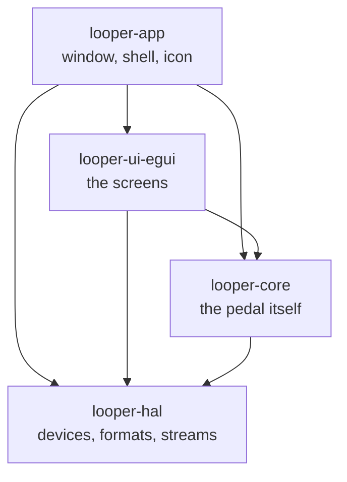
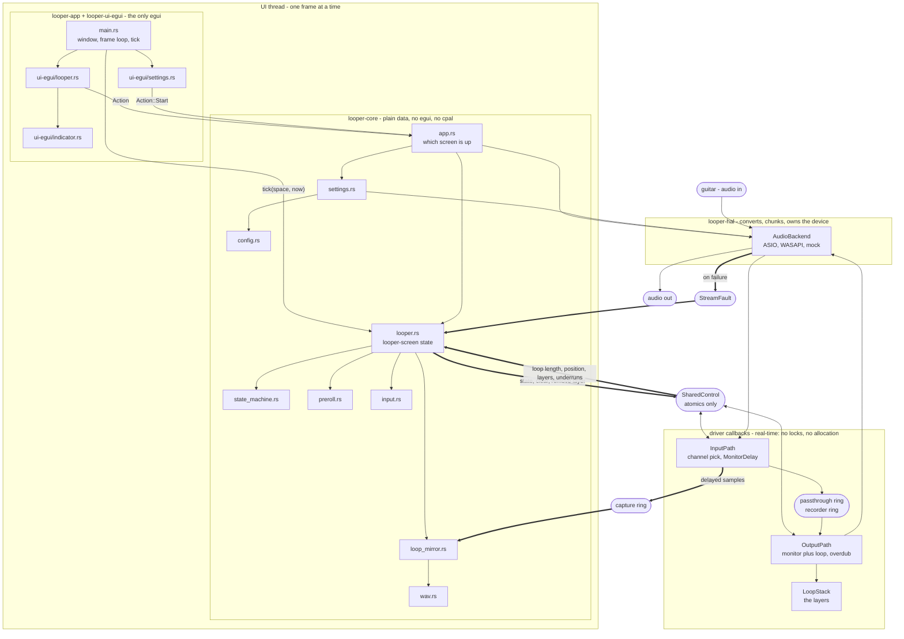

# Looper Pedal

A minimal single-track looper pedal replacement for practicing guitar
through an audio interface - one loop, stacked from overdub layers.
Standalone app, no DAW and no plugin host; Windows today, with the device
layer split off so that other platforms are a backend rather than a
rewrite. See `docs/user-guide.md` for how to use it; this document covers
the architecture and how to build it.

## Architecture

The app opens an audio device directly (input + output) rather than being
a plugin. Which device, and through which driver, is chosen in Settings:
ASIO where a driver is installed, WASAPI otherwise. Audio flows through a
lock-free pipeline driven by a state value published from the UI thread.

```
Guitar -> audio in (selected channel only) -> live monitor (always audible)
                                           -> mixed with loop playback
                                              (sum of all layers)
                                           -> duplicated to every output
```

Only the input channel chosen in Settings is captured - it's treated as
mono internally (recorded, looped) and duplicated equally across every
output channel, so a single guitar input is centered in both ears rather
than only coming out of one side. NAM (Neural Amp Modeler) integration is
explicitly out of scope for now - the signal is clean/dry throughout.

Samples are `f32` everywhere above the device, full scale at +/-1.0.
Whatever format the hardware actually speaks - i16, i24, i32, f32 - stops
at the backend, so no format assumption reaches the code that decides
what the app does. `sample.rs` owns the conversion at the two edges that
still deal in integers: the device, and the saved WAV.

### Crates



Not a chain, and the direction is the point. `looper-hal` sits at the
bottom and has never heard of loops, layers or takes; `looper-core` knows
what the pedal does and nothing about `cpal` or `egui`. So porting to
another operating system means writing an `AudioBackend`, and a second
look - or another toolkit - is a crate beside `looper-ui-egui` rather
than a change to either of the two below it.

`looper-hal` has no dependencies at all unless its `cpal` feature is
asked for, which is what lets `cargo test -p looper-core` run the bulk of
the suite on any platform with no audio SDK to build against.

### Thread boundary

The real-time audio callback stays strictly separate from UI/state logic:
no locks or allocations on the audio thread. State changes (button
presses, mode transitions) and telemetry (loop length, playback position)
cross the thread boundary via `SharedControl`, which is nothing but a
handful of atomics - no mutex anywhere in the audio path.

- **UI thread** owns `LoopStateMachine` (the actual state) and publishes
  its value into `SharedControl` whenever it changes.
- **Audio thread** (the output callback) owns `LoopStack` exclusively -
  it's never shared with the input callback. The input callback only
  reads `SharedControl`'s published state to decide whether to feed
  captured samples toward the recorder.

Both callback bodies are `InputPath::process` and `OutputPath::process`,
which is how the backend reaches them: they implement `looper-hal`'s
`InputProcessor` and `OutputProcessor`. Those impls live in `looper-core`
because the orphan rule puts them there, and rightly - the paths and the
promise they keep (no allocation, no locks, bounded work) belong
together. It also means the whole path can be driven by a test without
opening a device, which is how the recording alignment below is measured.

The callback only ever sees the published state *value*, never the
transitions, so it detects those itself by comparing against the state it
saw last: that's when the loop length gets fixed and an overdub layer is
opened or closed.

The one thing that crosses without being an atomic or a ring is
`StreamFault`, which a failing stream writes to and the screen reads. It
is deliberately *not* part of `SharedControl`: it is touched at most a
handful of times in a stream's life, and only once one has already gone
wrong, so a lock there costs nothing and keeps the message a flag could
not.

## Writing a backend

A backend is an `AudioBackend`, and there are four things it answers:
what devices exist, what each will agree to, how to negotiate a format,
and how to start. `looper-hal/src/mock.rs` is the smallest complete one -
no device behind it at all - and `cpal_backend.rs` is the real one.

Three things the existing backends had to get right, all of them learned
from hardware rather than from documentation:

- **A device is identified by name *and* direction.** WASAPI presents an
  interface's capture and render halves as separate devices under the
  *same name*, so a lookup by name alone finds whichever the driver
  listed first. Worse, handing a render endpoint to a capture stream does
  not fail - `cpal` turns it into a loopback and you silently record the
  speakers. `caps` takes a whole `DeviceInfo` for exactly this reason.
- **Opening is two-phase.** `open` negotiates and stops; `start` takes
  the processors. The caller cannot build them earlier, because ring
  sizes, the monitoring delay and the layer stack are all measured in
  samples against the rate and channel counts that were actually
  *granted* - and a shared-mode endpoint hands back its own mix rate
  whatever was asked for.
- **Input and output channel counts are separate.** On a split backend
  the capture end is often narrower than the render end. One count fed to
  both paths de-interleaves at the wrong stride, which produces no error
  at all - just the wrong samples.

Two `looper-hal` examples exist to be run against real hardware, since
none of this can be checked without it:

```powershell
cargo run -p looper-hal --features asio --example list_devices
cargo run -p looper-hal --features asio --example open_device -- asio
```

`open_device` opens a device for real and reports drift and wander
between the two ends - see "Recording alignment".

## Module layout

Solid arrows are plain calls. Thick arrows cross a thread boundary, and
only ever through atomics or a ring buffer.



Three asymmetries the picture makes plain, and the prose above hides:

- **Nothing reaches into the audio side.** Everything the UI thread
  wants done crosses as a value it writes and forgets - a state, a
  one-shot flag - and `LoopStack` is only ever reachable from inside
  `OutputPath`. There is no arrow pointing at it from the left.
- **The two directions carry different things.** UI to audio is a
  handful of atomics. Audio to UI is those, plus a whole stream of
  samples through the capture ring, which is why the UI thread's copy
  of the loop exists at all.
- **`ui-egui/` is a leaf.** It reads a model and returns an `Action`; it
  never writes one. Swapping GUI library means replacing that crate and
  `main.rs`'s shell, and nothing below them.

The files themselves:

```
crates/
  looper-hal/                devices, formats, streams - no looping
    src/lib.rs                the traits and types every backend meets
    src/cpal_backend.rs       ASIO and WASAPI, behind the `cpal` feature
    src/mock.rs               a backend with no device, for tests
    examples/                 list_devices, open_device - need hardware
  looper-core/               the pedal itself - no cpal, no egui
    src/looper.rs             looper-screen state: state machine, the
                              audio relay, the live stream, per-frame tick
    src/settings.rs           settings-screen state: backend/device/rate
                              lists and what's selected
    src/action.rs             what a rendered frame asks the app to do
    src/config.rs             the settings, as TOML in the per-user
                              config dir (config_tests.rs)
    src/input.rs              short-press vs long-press-clear detection
    src/state_machine.rs      the pedal logic - pure, no audio, no egui
    src/preroll.rs            the countdown before the first recording
    src/loop_mirror.rs        the UI thread's own copy of the loop, and
                              saving it (loop_mirror_tests.rs)
    src/wav.rs                mono 32-bit PCM, by hand (wav_tests.rs)
    src/sample.rs             f32 <-> 32-bit PCM, one definition
    src/audio/engine.rs       the audio path, and opening a looper on a
                              backend (engine_tests.rs)
    src/audio/loop_stack.rs   pre-allocated stack of aligned mono layers
    src/audio/shared_control.rs  lock-free UI <-> audio thread relay
    src/audio/fault.rs        where a failing stream leaves word
  looper-ui-egui/            rendering only - `render(ui, model) -> Action?`
    src/looper.rs             the looper screen
    src/settings.rs           the settings screen
    src/indicator.rs          state circle + label + progress bar widget
  looper-app/                the binary
    src/main.rs               eframe glue: window, frame loop, tick
    src/app.rs                which screen is up, and acting on actions
    src/icon.rs               the app icon, drawn as RGBA at any size
    build.rs                  generates the .ico from `icon.rs`
```

`looper-core` holds no `egui::` types at all and `looper-hal` holds no
looping logic, so neither end can quietly acquire a dependency on the
other. `main.rs` and `looper-ui-egui` are the only framework-aware parts.

Tests live in sibling `*_tests.rs` files (via `#[path = "..."] mod tests;`)
rather than inline, to keep the implementation files themselves short -
see any of the pairs above. Run them with `cargo test`.

## State machine

Mimics a classic single-footswitch looper pedal:

1. **Idle** (empty) --press--> **Recording**
2. **Recording** --press--> **Looping** (recording stops, loop length is
   fixed, playback starts immediately and loops seamlessly)
3. **Looping** --press--> **Stopped** (playback silenced, loop stays in
   memory)
4. **Stopped** --press--> **Looping** (resumes the same loop)

**Long-press**, from any state, clears the loop and returns to Idle - it
fires the moment the hold crosses the threshold while still held, not on
release. How long that hold is is the `long_press_ms` setting, 2s by
default, and the looper screen's hint line says the configured value.

### Pre-roll

With a **record delay** set in Settings (5s by default), step 1 goes
through **Arming** instead: a bar fills as the wait runs out, then
Recording. It's for the first recording only - once a loop is playing
you're already in time with it - and a press part-way through calls it
off, back to Idle.

The countdown runs on the UI thread, which already ticks every frame and
already works in `Instant`, so no timing code goes anywhere near the
audio callback: the callback sees `Arming` and captures nothing, exactly
as it does for `Idle`, until the state flips to `Recording`. `Arming` is
still a published state of its own rather than being hidden from the
audio thread, because a metronome count-in eventually needs to click
during that window. Input is handled before the countdown each frame, so
a press meant to cancel wins over the countdown happening to run out on
the same frame.

**Overdub** deliberately sits *off* that cycle, on its own control (the
`O` key or the Overdub button), so the press cycle above keeps behaving
as the four states above: **Looping** <--overdub--> **Overdubbing**. A
press while overdubbing stops playback, like it does while looping - the
main control always means "stop" when something is playing.

### Layers

The first recording fixes the loop length; each overdub adds another
layer on top, and playback is their sum. `max_layers` of them can be
stacked, four by default, and the newest can be dropped again ("Remove
last") - dropping the only one is the same thing as clearing.

Each layer is a full-length pre-allocated buffer, but an overdub can
start anywhere in the loop and be stopped early, so a layer only counts
as recorded over the window it was actually played into (`written`
samples from `start`). Outside that window it's never read, which is what
lets a layer be reused without memsetting megabytes inside the audio
callback. Two consequences worth knowing:

- A take is mixed in *before* the incoming sample is written over it, so
  you never hear the pass you're currently playing echoed back on top of
  your live signal - it comes back from the next pass onward.
- Overdubbing past the end of the loop sums into the same layer rather
  than replacing it, so a second pass doesn't erase the first.

### Layer volume

There is no per-layer gain: every layer plays back at the level it was
recorded at, and Settings' single "Loop volume" is the only control over
them - it scales the whole stack, still leaving the live passthrough
alone.

Stacked takes can sum past full scale, and nothing upstream clamps them:
the loop volume is applied to the whole sum, and what is still over full
scale is clipped once, at the conversion out to the device. Clamping
earlier would make a hot stack permanently crunchy - and would take the
live passthrough down with it, since the dry signal is added *after* the
loop bus. This way turning the loop volume down still recovers it.

### Recording alignment

The dry passthrough carries `latency_ms` of headroom between the two
callbacks - that headroom is what absorbs their jitter - so you hear
yourself that much after the fact. The recorded signal is held back by
the same amount (`MonitorDelay`) before it reaches either the layer
stack or the UI thread's copy. Without that, the sample stored at loop
position p would be a whole monitoring delay fresher than the one heard
at p: takes would land ahead of the beat they were played against, and
every layer stacked on top would inherit the error again. An
`engine_tests.rs` measurement drives both callbacks with a ramp and
asserts the offset is zero.

The rings hold `latency_frames + MAX_BLOCK_FRAMES` so a driver buffer
larger than the delay still fits - the prefill, not the capacity, is
what sets the delay.

All of that assumes the two callbacks are driven by one clock, which is
worth knowing because backends differ sharply. Measured with
`open_device` against an Audient iD4 at 44.1 kHz:

| | ASIO | WASAPI (same interface) |
|---|---|---|
| shape | one duplex handle | two endpoints, same name |
| callback period | 64 frames (1.5 ms) | 441 frames (10 ms) |
| render block | fixed | variable, up to ~970 |
| drift | 0 ppm | 0 ppm |
| wander | 64 frames (1.5 ms) | 882 frames (20 ms) |

Neither **drifts**: WASAPI's shared mode runs both ends through the
Windows audio engine, which resamples onto its own clock - so even two
*different* interfaces stay in step. What differs is the **wander**.
ASIO's 64 frames is the floor, being exactly one callback period; WASAPI
swings by twenty milliseconds, and `MonitorDelay` holds back by a fixed
amount, so nothing takes that back out. A take can land either side of
where it was heard, and every layer inherits it again. The settings
screen says so when a split backend is chosen.

## Settings & persistence

On first run (or if the saved config no longer opens - e.g. the interface
was unplugged), the app shows a Settings screen: pick the driver, the
device, sample rate and input channel, and set anything in the table
below. A driver whose devices do both directions (ASIO) shows one device
picker; one whose devices are single endpoints (WASAPI) shows two, and
the rates offered are the ones *both* ends will take - a shared-mode
capture endpoint often offers only its own mix rate while its render half
claims a range it would have to resample to reach. On
"Start" this is saved and the app launches straight into the looper on
subsequent
runs. The gear icon (top-right, in the looper screen) reopens Settings at
any time, pre-selecting whatever's currently active.

Settings are TOML in the per-user config directory:

- Windows: `%APPDATA%\looper-pedal\config.toml`
- Linux: `~/.config/looper-pedal/config.toml`
- macOS: `~/Library/Application Support/looper-pedal/config.toml`

Next to the executable - where they used to live - stops being writable
the moment the app is installed somewhere like Program Files, and the
recorded loop will want a per-user directory of its own soon anyway.

`device_name` and `sample_rate` are required; everything else falls back
to a default, so a config written by an older build still loads instead
of throwing you back to the settings screen. Unknown keys are ignored,
and comments are allowed, so the file is safe to hand-edit.

Two of those defaults encode what an older file *meant* rather than a
preference: a missing `backend` reads as `"asio"`, because every config
written before there were backends came from a build that could only open
ASIO, and a missing `output_device_name` means the output is the input
device, which is what a duplex driver has. Retargeting somebody's
interface on upgrade is the kind of thing that reads as the app
breaking.

Every setting's default and allowed range is declared once, in
`config.rs`: the settings screen builds its sliders from those ranges,
and a hand-edited file is clamped to them on load. Nine hundred layers
of a two-hour loop would otherwise try to allocate terabytes before the
window opened.

| Setting | Default | Range | Effect |
|---|---|---|---|
| `volume_pct` | 100 | 0-200 | loop playback gain, live signal untouched |
| `preroll_ms` | 5000 | 0-5000 | wait before recording starts; 0 = off |
| `long_press_ms` | 2000 | 500-4000 | how long a hold clears the loop |
| `latency_ms` | 8 | 2-50 | callback headroom - raise it if the log reports underruns |
| `max_loop_secs` | 60 | 10-120 | longest recordable loop |
| `max_layers` | 4 | 1-8 | layers including the first recording |

The last two are a memory multiplier - every layer is pre-allocated at
the full loop length, so it costs `seconds x layers x sample rate x 4`
bytes, and the settings screen shows the figure next to the sliders.

Deliberately *not* settings, and living in `looper-hal` because they are
statements about devices rather than about the app: `MAX_BLOCK_FRAMES`
(the bound on one callback - what a driver might hand us, not how anyone
wants the app to behave; it sizes the scratch buffers and the headroom in
the rings) and `CANDIDATE_SAMPLE_RATES` (a probe list, not a choice).
Nor are the window and widget sizes.

## Saved loops

The recorded loop survives closing the app: one WAV per layer, beside the
config -

- Windows: `%APPDATA%\looper-pedal\loop\layer-1.wav`, `layer-2.wav`, ...

Mono 32-bit PCM, written by hand (`wav.rs`) rather than through a
dependency. They're deliberately ordinary files: any editor opens them,
and the eventual "export loop" feature becomes a copy rather than a
converter.

Written whenever the loop changes, not on the way out, so a crash or a
kill doesn't lose it. On launch the layers come back and the looper
starts **Stopped** - the loop is there, silent until asked for. A saved
loop is discarded rather than adapted if it was recorded at a different
sample rate (there's no resampling) or is longer than `max_loop_secs`
now allows; layers past `max_layers` are dropped on their own, the ones
underneath being independent takes. `loop_mirror::load` decides all of
that in one place, so the layer stack and the UI thread's copy are
always seeded from the same list.

### Why a second copy exists

`LoopStack` lives inside the output callback, where nothing may reach in
and read it - so the UI thread keeps its own copy (`loop_mirror.rs`) to
have something it can write. The input callback pushes captured samples
into a second ring buffer alongside the recorder's, and the UI thread
drains it each frame. Same lock-free audio -> UI direction as the
telemetry; no lock anywhere near the callback. Both rings are fed from
the same delayed signal (see below), so the two layouts describe the
same audio.

Takes are stored as they were played - where each began, and the samples
- and only laid out into full-length layers when saving, so the copy
costs about what was recorded rather than a second full-size stack. Two
consequences worth knowing:

- **The overdub layout rule exists twice**: the audio thread applies it
  sample by sample as it plays, the mirror applies it to a whole take at
  once. A test asserts the two agree, because drift between them would
  mean a loop that reloads sounding different from the one that was
  played.
- **If samples ever go missing** on the way to the copy (its ring
  overflowing because the UI stalled), the save is skipped rather than
  writing a loop that doesn't match what was heard. The count comes back
  through `SharedControl` like the underrun counters.

## Build prerequisites (Windows)

- Rust via `rustup`, MSVC toolchain (`x86_64-pc-windows-msvc`)
- Visual Studio Build Tools - "Desktop development with C++" workload
  (needed for linking, and for compiling the ASIO SDK's C++ shim)

Everything below is needed only for the **ASIO** backend, which the app
crate asks for by enabling `looper-hal`'s `asio` feature. WASAPI needs
none of it, and neither does `cargo test -p looper-core`:

- LLVM/libclang (needed by `bindgen`, which `asio-sys` uses to generate
  bindings to the ASIO SDK headers)
- Steinberg ASIO SDK - dual-licensed (GPLv3 or proprietary) since Oct
  2025; `asio-sys` (used by `cpal`) auto-downloads it during
  `cargo build` if `CPAL_ASIO_DIR` is left unset, so there's normally
  nothing to fetch by hand

## Building & running

```powershell
cargo build                  # compile the workspace
cargo run -p looper-app      # build + launch
cargo test                   # every crate - no device needed, audio path included
cargo test -p looper-core    # the bulk of the suite, and no ASIO SDK to build
```

The last line is the one to reach for on a machine - or a platform -
without the ASIO SDK set up: `looper-core` depends on `looper-hal` with
its `cpal` feature off, so nothing device-shaped enters the build.

The app icon is drawn in code (`icon.rs`) rather than stored as an
image: a green loop arrow around a red record dot. That means no
image-decoding dependency and no binary asset in the repo, and it
renders at any size - the window asks for one, and `build.rs` `include!`s
the same file to generate a multi-size `.ico` for the executable's icon
resource. Embedding needs `rc.exe` from the Windows SDK; if it's missing
the build warns and carries on without the exe icon.

Debug builds are console-subsystem binaries, so `cargo run` keeps a
terminal alongside the window - that's where the stream config and the
underrun log print. Release builds set `windows_subsystem = "windows"`
and have no console at all, so the two things worth knowing about reach
the looper screen instead: a stream that fails says so with a button back
to Settings, and underruns show as a count naming the setting that fixes
them. The console still carries more detail, so a debug build is still
the better place to chase audio trouble from.

The app is developed against an Audient iD4 MkII, but no longer assumes
anything about it: the backend negotiates whatever format a device
reports (i16, i24, i32 or f32) and converts at the edge, so other
interfaces should work. ASIO is what it is tuned for - WASAPI runs, and
is what a machine with no ASIO driver gets, at roughly an order more
latency and with the timing wander noted under "Recording alignment".
