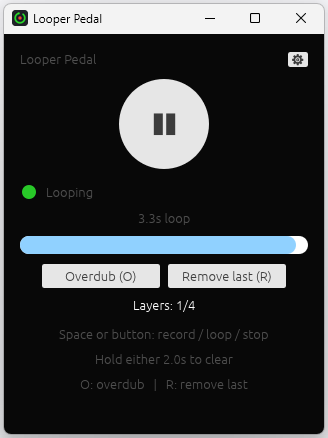

# Looper Pedal - User Guide

A simple looper pedal for practicing guitar, replacing a hardware looper
like the TC Electronic Ditto. One main control - press to record, press
to loop, press to stop, hold to clear - plus overdub, for stacking a few
layers on top of the loop.

## First run

The first time you launch the app, you'll see a **Settings** screen:

1. **Driver** - how the app talks to your interface. Pick **ASIO** if
   it's offered: it's what your interface's own driver provides, and it's
   the one with low enough latency to play through comfortably. **WASAPI**
   is always there and needs no driver of its own, but it's noticeably
   less immediate - see "If ASIO isn't offered" below. This row only
   appears when there's more than one to choose from.
2. **Device** - pick your audio interface. On ASIO one device is both
   your input and your output. On WASAPI they're listed separately, so
   you'll see an **Input** and an **Output** row instead - and watch out
   for anything called "Loop-back" or "Stereo Mix", which records what's
   *playing* rather than what you're playing.
3. **Sample rate** - pick a rate your interface supports (44100 Hz is a
   safe default). Only rates both ends can manage are listed, so the
   list may be shorter on WASAPI.
4. **Input channel** - pick whichever input your guitar cable is
   actually plugged into (e.g. "Input 1"). Only this one channel is used;
   it's centered equally in both ears when you monitor, so it doesn't
   matter that it came from a single input.
5. **Loop volume** - how loud the loop plays back relative to your live
   signal
6. **Record delay** - how long to wait after you hit record before it
   actually starts capturing, so you have time to get your hands back on
   the guitar. Defaults to **5 seconds**; drag it down to **off** if
   you'd rather it start immediately.
7. **Hold to clear** - how long the button or spacebar has to be held
   down to wipe the loop. Two seconds by default.
8. **Latency** - how much headroom the audio engine keeps. Lower feels
   more immediate; if the sound crackles or drops out, raise it.
9. **Max loop length** and **Max layers** - the longest loop you can
   record and how many layers you can stack. Both are reserved in
   memory up front, so the line underneath tells you what your choices
   will cost - there's no reason to ask for more than you'll use.

Click **Start**. Your choices are remembered, so next time the app opens
straight into the looper - you won't see Settings again unless you
reopen it yourself (see below) or your saved device becomes unavailable
(e.g. the interface is unplugged).

They're kept in a small text file you can read or edit by hand if you
ever want to:

- Windows: `%APPDATA%\looper-pedal\config.toml`
- Linux: `~/.config/looper-pedal/config.toml`
- macOS: `~/Library/Application Support/looper-pedal/config.toml`

Delete it to start over from the Settings screen.

## Using the looper

*Mid-loop: one layer recorded, the bar showing where in the loop
playback is, and the main button offering pause.*

One control drives everything - either the **spacebar** or the on-screen
round button. They're fully interchangeable.

| Press | What happens |
|---|---|
| 1st press | Start recording (or start the countdown, with a record delay set) |
| 2nd press | Stop recording, loop starts playing immediately |
| 3rd press | Stop the loop (silence, but it's still remembered) |
| 4th press | Resume playing the same loop |
| **Hold it down** | Clear the loop, from any state - back to empty. Two seconds by default; the hint line under the buttons says how long yours is set to |

Your live guitar signal is always audible, whether or not a loop is
playing - the loop just plays back on top of it.

The colored dot shows what's happening:

- **Gray** - Empty, nothing recorded
- **Blue** (pulsing) - Get ready: waiting out the record delay before
  recording starts. The seconds left count down where the recording
  time normally shows, with a light gray bar filling beneath it -
  recording begins when the bar is full. The button shows **✖**: press
  it to call the whole thing off.
- **Red** (pulsing) - Recording, with elapsed time shown
- **Green** - Looping, with the loop's length and a progress bar showing
  where in the loop you currently are
- **Orange** (pulsing) - Overdubbing a new layer over the playing loop
- **Amber** - Stopped, loop length still shown, progress bar frozen where
  it left off

## Overdubbing

Once a loop is playing, press **O** (or the **Overdub** button) to start
layering on top of it. Whatever you play is added to the loop; press
**O** again to finish that layer. **Max layers** in Settings sets how
many you can stack including the first recording - four by default - and
the counter under the buttons shows where you are.

A few things worth knowing:

- You won't hear the layer you're currently playing come back at you
  while you play it - you're already hearing yourself live. It joins the
  loop from the next time around.
- Keep playing past the end of the loop and it keeps adding to the same
  layer, so you can build something up over a couple of passes without
  erasing what you already put down.
- You don't have to start at the top of the loop. Start wherever you
  like, stop whenever you like - only the part you played is recorded.
- **Remove last** drops the most recent layer if you're not happy with
  it, leaving the others playing. Dropping the only remaining layer
  clears the loop.
- Pressing the main control (space or the round button) while
  overdubbing stops playback, exactly as it does while looping. The
  layer you were recording is kept.
- Every layer plays at the level you recorded it, so play each one at
  the volume you want it in the mix. If the stack ends up too loud
  overall, turn **Loop volume** down in Settings - it covers the whole
  loop at once and leaves your live signal untouched.

## Your loop is kept

Closing the app doesn't lose the loop. Next time you open it, the loop is
back exactly as you left it, layers and all - **stopped**, so nothing
plays until you press. It's saved as you record rather than on the way
out, so even a crash won't take it with it.

The layers are ordinary WAV files, one per layer, next to the settings
file (`%APPDATA%\looper-pedal\loop\` on Windows) - so you can open
them in any audio editor, or delete them to start clean.

Two things will make a saved loop *not* come back: changing the **sample
rate**, since the recording no longer matches the device, and lowering
**Max loop length** below the loop's own length. Either way it's dropped
rather than mangled. Lowering **Max layers** is gentler - the layers that
still fit come back and the ones on top are dropped, since each layer is
a take in its own right.

## Changing settings later

Click the small **⚙** icon (top-right of the looper screen) at any time
to reopen Settings and change anything there. It remembers your current
choices, so you're not starting from scratch.

Your loop is kept while you're in there and comes back when you press
**Start** - it's read from the saved WAV files, the same way it is when
you reopen the app.

## If ASIO isn't offered

ASIO is provided by your interface's own driver. If the Driver row only
shows **WASAPI**, install the driver from your interface manufacturer's
site and restart the app.

WASAPI works, and is worth using if that's all you have - but it is
Windows' shared audio path rather than a direct line to your interface,
and two things follow:

- **It's less immediate.** Expect something like ten times ASIO's delay
  between playing a note and hearing it. If you monitor through your
  interface's own headphone output instead, that stops mattering for
  what you *hear* - but it still affects where your overdubs land.
- **Overdubs are looser.** Takes can sit up to about 20 milliseconds
  either side of where you heard them, and each layer you stack inherits
  it afresh. Fine for practising over a chord loop; not tight enough for
  anything percussive. The Settings screen says so when you pick it.

## When something goes wrong

Two messages can appear at the top of the looper screen:

- **"Audio stopped: ..."** - the interface stopped responding, most
  often because it was unplugged or another program took it. The loop in
  memory is safe and already saved. Click **Choose a device** to pick it
  again (or pick a different one) and carry on.
- **"Audio fell behind Nx - raise Latency in Settings"** - the machine
  couldn't keep up, and there will be small gaps in what you just
  recorded. Raise **Latency** a notch or two. It counts up over the whole
  session, so a number that stops growing means whatever caused it has
  passed.

## Not yet supported

This is an early, minimal version. Not (yet) included: trimming the
start/end of a loop, muting individual layers, amp modeling (NAM),
saving loops to a file, or a metronome/tempo sync.
